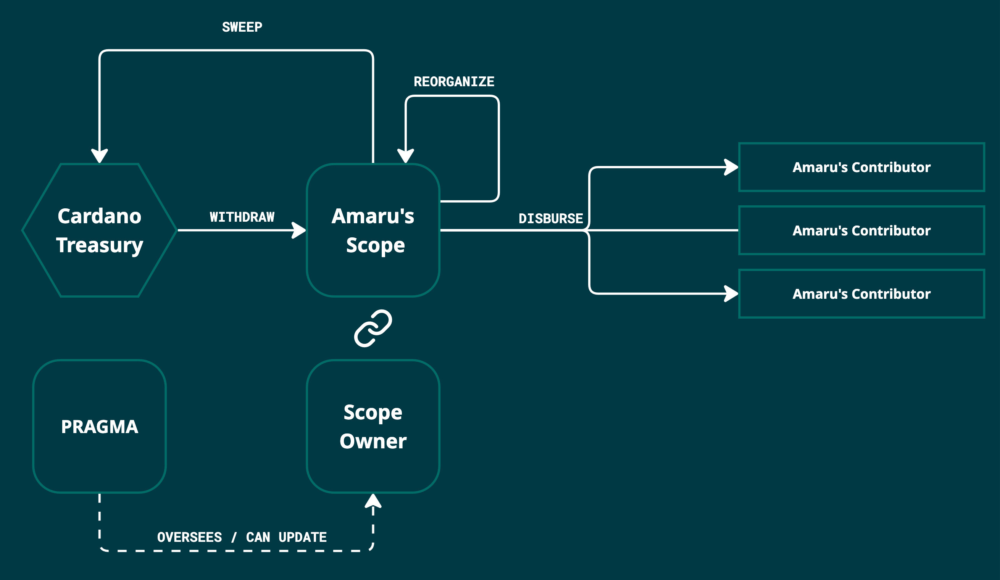

# Amaru Treasuries Contracts

## Overview

The [Amaru](https://github.com/pragma-org/amaru) maintainer committee ensures **direct administration** of its budget, assisted with **an on-chain smart contract**. Off-chain, the fund management, responsibilities and remuneration of contributors follow [PRAGMA's Maintainer Committee Framework](https://ipfs.io/ipfs/bafkreiabxyva5lfm6zztg7tnktxvvbbucljrce7hlrp4p6hropqzfaip3y). In addition, the smart contract's role is to ensure that the expenditure of funds is done in accordance with the scope defined in this budget and authorized by the relevant scope owners.

We recognize the following capabilities of this contract:

1. **Standard withdrawal**: A scope owner initiates and asks another scope owner for money to be withdrawn from his scope.
2. **Contingency withdrawal**: A scope owner asks all other scope owners to withdraw an amount from the contingency funds.
3. **Scope reconciliation**: A scope owner asks other scope owners for a change of ownership (or a reallocation of budget).
4. **Contingency refund/closing/failsafe**: any leftovers from scopes or from the contingency budget can be sent back to the Cardano treasury after an ageed-upon delay.
5. **Credential rotation**: In case of lost credentials or the departure of a scope owner, a mechanism allows the rotation of credentials to a new scope owner upon approval by all (5 out of 5) PRAGMA members.

<picture>
  <source media="(prefers-color-scheme: dark)" srcset=".github/img/treasury-overview-dark.jpg" />
  <source media="(prefers-color-scheme: light)" srcset=".github/img/treasury-overview-light.jpg" />
  
</picture>

### How does it work?

Each Amaru treasury contract comprises of 4 validators, each with specific role. One of them, the scopes, is shared across all treasuries. Others are specific to each scope.

#### Treasury

Each treasury validator (one per scope) re-uses [Sundae's treasury management setup](https://github.com/SundaeSwap-finance/treasury-contracts) and define a single _permissions_ script (detailed below) for all supported operations: `sweep`, `reorganize` and `disburse`. The `fund` action is disabled and never used. Amaru will use the `disburse` action to pay vendor with the addition of the off-chain legal framework.

See also [docs/treasury.md](./docs/treasury.md).

#### Permissions

Permissions scripts are executed as withdrawal actions (using the withdraw-zero pattern) for each action of the treasury. They provide additional restrictions on the execution of each action. With the exception of the contingency scope, permissions ensure that the actions `sweep` and`disburse` are authorized by the scope owner and an additional scope owner. The action `reorganize` can and must only be authorized by the scope owner.

In the case of the contingency budget, `sweep` and `disburse` must be authorized by everyone; whereas `reorganize` can be authorized by any scope owner.

See also [docs/permissions.md](./docs/permissions.md).

#### Registry

To avoid circular dependencies in validators, we must store references to the treasury contract address at a datum on-chain, identified by a specific NFT. The minting policy and management of that NFT is guarded by the registry validator. Burning is authorized only after the expiration date.

See also [docs/traps.md](./docs/traps.md).

#### Scopes

To allow dynamically changing the scope owners for each scope (in case of a key loss or actual change of owner), we must store scope owners credential at a datum on-chain, identified by a specific NFT. The minting policy and management of that NFT is guarded by the registry validator. Burning is authorized only after the expiration date.

See also [docs/traps.md](./docs/traps.md).

## Usage

### Pre-requisites

- aiken >= v1.1.17
- cardano-cli >= 10.4.0.0
- jq >= 1.5
- basenc (GNU coreutils) >= 9.1
- (optional) ogmios >= v6.10.0

### Configuring

> [!NOTE]
> The scopes (ledger, consensus, mercenaries, marketing, contingency) are pre-defined and not configurable.

| What                       | Where                              |
| ---                        | ---                                |
| PRAGMA's admin keys        | [aiken.toml](./aiken.toml#L33-L44) |
| On-chain scopes asset name | [aiken.toml](./aiken.toml#L33-L44) |
| Network                    | [Makefile](./Makefile#L3-L27)      |
| Seed UTxO for scopes NFT   | [Makefile](./Makefile#L3-L27)      |
| Seed UTxO for registry NFT | [Makefile](./Makefile#L3-L27)      |
| Initial scopes owners      | [Makefile](./Makefile#L3-L27)      |

### Running

> [!TIP]
>
> At any time, to get a friendly reminder of the configuration and commands, just run:
>
> ```console
> make help
> ```

1. `make scopes`

   This initialize the scope owners (from the Makefile's configuration) and prepare a minting transaction to publish them on-chain.
   The transaction must be signed and submitted through your own means.

2. `make permissions`

   Build each _permissions_ validators, each used to manage a treasury.

3. `make treasury`

   Build each _treasury_ validators as well as their corresponding registries.

4. `make registry`

   Prepare a minting transaction to publish all registries on-chain.
   The transaction must be signed and submitted through your own means.
