# Treasury

<table>
<thead>
<tr>
<th>Pi's explainer on the treasury validators</th>
<th>State diagram</th>
</tr>
</thead
<tbody>
<tr>
<td>
<video src="https://github.com/user-attachments/assets/9d859409-2337-47fd-be66-a04a3e71b25a"></video>
</td>
<td>
<picture>
  <source media="(prefers-color-scheme: dark)" srcset="../.github/img/treasury-state-diagram-dark.svg" />
  <source media="(prefers-color-scheme: light)" srcset="../.github/img/treasury-state-diagram-light.svg" />
  
</picture>  
</td>
</tr>
</tbody>
</table>

## Functionality

- Manage funds coming from either UTxO or a reward account enforcing only specific operations with clear semantic:
  - Reorganize: allows to collect and combine multiple sources (e.g. multiple UTxOs) back into another distribution with at least as much assets. This is typically used to merge several UTxOs back into one for easier treasury management.
  - Sweep: after an agreed-upon expiration date, allows sending all ADA leftovers (unconsumed budget) back to the Cardano's treasury. Any native asset (e.g. USDM), is kept within the contract.
  - Disburse: allow payment of funds (ADA or native assets) into an arbitrary address.

- Each operation is also delegating authorization to a _permission_ script (pre-configured at compile time), which can take the form of a multisig or, another script execution (through the withdraw-0 pattern).

- There are extra functionality related to a `Fund` action and a _vendor_ script to ensure regular payouts to vendors. But, we make no use of these in the Amaru setup. There are, in fact, fully disabled through multiple ways (permissions, registry, ...)

## Parameters

1. `config: TreasuryConfiguration`: hard-wired parameters such as the registry script hash, and the set of permissions scripts.

   ```aiken
   pub type TreasuryConfiguration {
     // The token used to authenticate the script hash registry
     registry_token: PolicyId,
     // The permissions required for different options
     permissions: TreasuryPermissions,
     // The time after which the funds can be swept back to the treasury
     expiration: Int,
     // The upper bound for any payouts created by the oversight committee
     payout_upperbound: Int,
   }
   ```

> [!NOTE]
>
> 1. For the first Amaru withdrawal, the `expiration` date is set to the _31st of December 2025, 23:59:59_.
>
> 2. We set the `payout_upperbound` to `0` since this is only used in the (unused) `fund` action.
